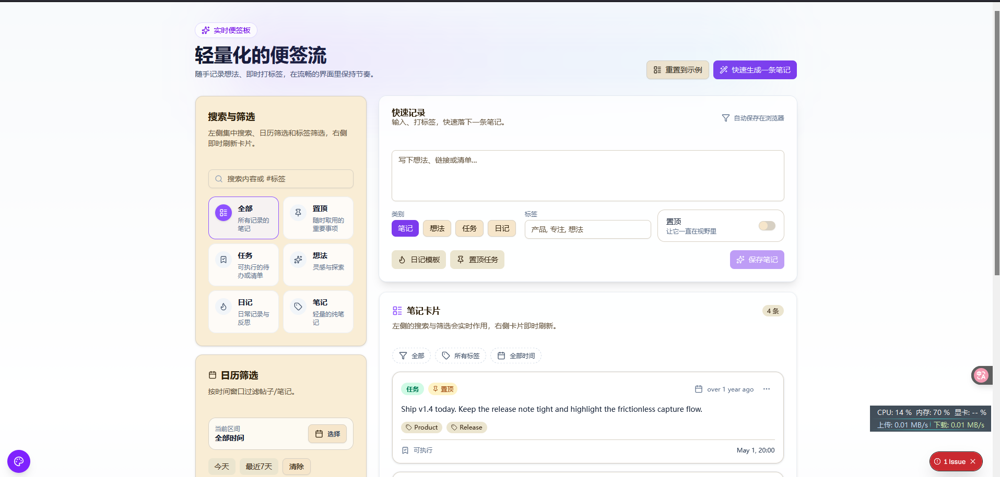

# Memo Notes

Memo Notes is a focused memo board built with Next.js 16 + React 19 and shadcn/ui. Capture thoughts quickly, tag them, and keep a tidy stream that persists in the browser without setting up a backend.

**Highlights**

- Fast capture form with categories (note/idea/task/journal), tags, pinning, and quick templates
- Live stream with search, tag picker, and category filters; sorted by freshness and pinned on top
- LocalStorage persistence plus a one-click reset back to the demo dataset
- Snapshot cards for totals, pinned count, and open tasks, updated in real time
- Responsive layout and dark mode-ready styling powered by Tailwind CSS v4 and Geist fonts

**Tech Stack**

- Next.js 16 App Router, React 19, TypeScript strict
- shadcn/ui + Radix primitives, Tailwind CSS v4 tokens in `app/globals.css`
- TanStack Query provider scaffolded in `app/layout.tsx`
- Zustand utilities in `lib/store`, Supabase client placeholder in `lib/supabase-client.ts`
- Tooling: Biome formatter (`pnpm fix`), ESLint, Vitest + RTL (`tests/setup.ts`)

## Getting Started

- Prerequisites: Node.js 18+ and `pnpm`
- Install: `pnpm install`
- Configure env: copy `.env.local` and set your values (example below)
- Develop: `pnpm dev` (defaults to http://localhost:3333)
- Build: `pnpm build` then `pnpm start`

Example `.env.local`:

```env
NEXT_PUBLIC_SUPABASE_URL=http://localhost:54321
NEXT_PUBLIC_SUPABASE_ANON_KEY=your_supabase_anon_key
```

## Key Commands

- `pnpm dev` run the app locally on port 3333
- `pnpm lint` / `pnpm fix` lint and format with Biome
- `pnpm test` / `pnpm test:coverage` run Vitest (UI mode: `pnpm test:ui`)
- `pnpm build` create a production build; `pnpm start` serve it
- `pnpm shadcn` add new shadcn/ui components; `pnpm taze` bump deps; `pnpm clean` remove `node_modules`

## App Tour

- `app/page.tsx` memo board with capture form, filters, tag usage chips, and live stream
- `app/layout.tsx` roots providers (Geist fonts, TanStack Query)
- Additional demo routes remain from the starter (`/dashboard`, `/profile`, `/data-fetching`, `/form-handling`, `/integration-demo`) and can be removed when focusing solely on memos
- Shared UI lives in `components/` (shadcn/ui under `components/ui`); utilities in `lib/`; hooks in `hooks/`; tests in `tests/`

## Data & Persistence

- Memos persist to `localStorage` under the `memos-demo` key
- Use “Reset to demo” in the header to restore the seeded examples
- No backend is required; bring your own Supabase/project APIs by wiring data fetching into the existing TanStack Query provider

## Testing & Quality

- Run `pnpm test` for unit tests (jsdom + React Testing Library); config in `vitest.config.ts` and `tests/setup.ts`
- Run `pnpm lint` or `pnpm fix` before committing; Biome/ESLint configs are in `biome.json` and `eslint.config.mjs`

## Deployment

- Designed for Vercel/Next.js hosting; any platform that runs `next start` after `pnpm build` works
- Remember to set production env vars (`NEXT_PUBLIC_SUPABASE_URL`, `NEXT_PUBLIC_SUPABASE_ANON_KEY`, plus any new ones you add)

# Screenshot


